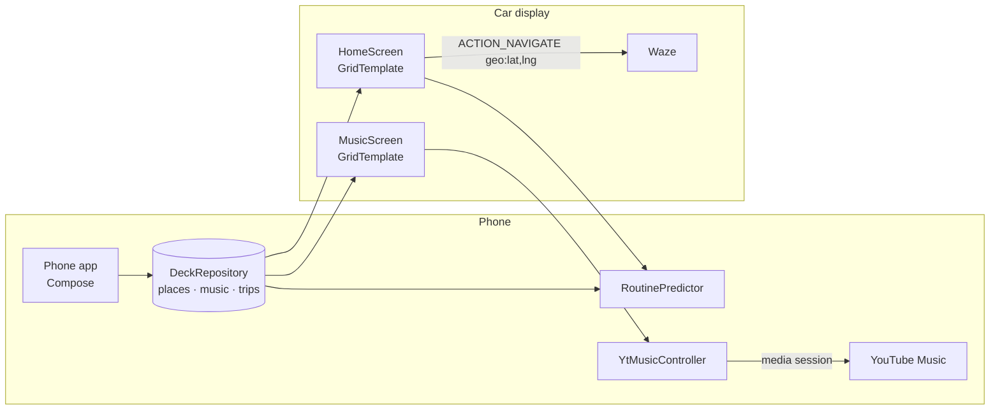

<div align="center">

# DRIVEDECK

**A smarter Android Auto home screen. One tap to your usual destination, one tap to your music.**

Kotlin · Jetpack Compose · Android for Cars App Library · on-device routine learning


</div>

---

## Why

Android Auto gets the basics wrong for daily driving:

- **Navigation by voice is unreliable.** Asking Assistant for your usual places often ends in the wrong result, or in Google Maps when you wanted Waze.
- **Music is hard to reach.** Finding a specific playlist while driving takes too many taps and menus.
- **It doesn't learn.** You drive the same routes every week, and it still asks every time.

DRIVEDECK puts the right destination and the right music **one tap away** on the car display, and learns your routine as you drive.

## Features

| | |
|---|---|
| **Smart "right now" suggestion** | Learns from your trips by time of day, weekday and recency. Monday 8 am suggests **Greenhse**, Tuesday 6 pm suggests **Gym**. The suggested tile is highlighted green and placed first. |
| **One-tap Waze navigation** | Tap a place on the car screen and DRIVEDECK hands exact coordinates to Waze, which starts driving immediately. No voice recognition, no search results to pick from. |
| **Context-aware ordering** | Places are sorted by how likely you are to want them right now. The place you're already at goes last, so there's no "Go home" when you're home. |
| **YouTube Music hub** | Your playlists, artists and mixes as big car-screen tiles. One tap starts playback through YouTube Music's media session (the same mechanism Google Assistant uses), with play/pause and skip controls. |
| **Phone setup app** | Add places by address or "I'm here now" GPS pin, manage music shortcuts, see what the app has learned, and a guided setup checklist. |
| **Private by design** | No account and no server. Everything stays on your phone. |

## How it works



- **`car/`** is the Android Auto UI, built with the official [Android for Cars App Library](https://developer.android.com/training/cars/apps) (POI category). Templates are validated by the library at build time, and the unit tests build them.
- **`smart/RoutinePredictor`** is plain Kotlin. Each past trip votes for its destination, weighted by a Gaussian on time of day (wraps at midnight), a 45-day recency half-life, and same weekday vs weekday/weekend match. Same-weekday history leads once there's enough of it, so weekly habits beat daily ones on the right day. It only suggests when one place clearly leads.
- **`music/YtMusicController`** controls YouTube Music through its media session: first the active session (needs notification-listener access, which is how Android gates media control), then by binding its media-browser service, then with a media-button wake-up sent only to YouTube Music, then with a play-from-search intent.
- **`data/DeckRepository`** is the single source of truth. It exposes StateFlows, so edits on the phone update the car screen immediately.

## Install (Samsung / any Android phone)

1. **Install the APK.** Download `DRIVEDECK-v1.0.0.apk` from [Releases](../../releases), open it, and allow installs from your browser or file manager.
2. **Open DRIVEDECK → Setup** and work through the checklist:
   - **Music control → Enable.** Turn on DRIVEDECK under *Notification access*.
     *Samsung / Android 13+:* sideloaded apps get this switch greyed out. Go to **App info → ⋮ → Allow restricted settings**, then try again.
   - **Location → Allow.** Optional; used for distances and "you're here" detection.
3. **Let Android Auto show sideloaded apps (one time):**
   - Settings → Connected devices → **Android Auto**
   - Scroll to the bottom and tap **Version** about 10 times, then accept developer settings
   - **⋮ → Developer settings → tick "Unknown sources"**
   - Back in Android Auto settings → **Customise launcher** → make sure DRIVEDECK is ticked
4. **Plug into the car.** DRIVEDECK is in the Android Auto launcher. Open Waze once on the car screen so Android Auto uses it for navigation.

## Build from source

Requirements: JDK 17+, Android SDK 36.

```bash
./gradlew assembleDebug            # APK -> app/build/outputs/apk/debug/
./gradlew testDebugUnitTest        # 23 tests: predictor, links, car templates, UI render
./gradlew lintDebug                # clean
./gradlew testDebugUnitTest -Proborazzi.record   # re-render docs/screenshots
```

Test the car UI on your computer with the [Desktop Head Unit](https://developer.android.com/training/cars/testing/dhu).

## Tests

- `RoutinePredictorTest` covers commute patterns, weekly habits, fading old habits, ambiguity (no guessing), midnight wrap-around and exclusions.
- `NavLinksTest` covers geo/Waze deep links and distance maths.
- `CarScreensTest` runs Robolectric with the Car App Library's `TestCarContext`. It builds the real templates, checks the suggestion comes first, taps a tile and checks a navigation intent is sent.
- `PhoneScreenshotTest` uses Roborazzi to render every phone tab (these produce the screenshots above).

## Limitations

- Android Auto only allows third-party apps in set categories. DRIVEDECK is a *POI* app, so Waze (not DRIVEDECK) draws the map and picks the route. DRIVEDECK picks the *destination*.
- YouTube Music has no public API. Playback uses Android's media-session "play from search". It works well for playlists and artists, but it's search-based, so paste a YouTube Music link for an exact match.
- Unpublished apps need Android Auto's "Unknown sources" setting (above).

## Roadmap

- [ ] Voice shortcuts ("DRIVEDECK, gym") using the car microphone (Car API 5+)
- [ ] Calendar-aware suggestions (next event location)
- [ ] Traffic-aware "leave now" nudges
- [ ] Home-screen widget for the phone

## Credits

Icons: [Material Design Icons](https://pictogrammers.com/library/mdi/) (Apache 2.0).
Built by **Lazar** · Perth, WA.
