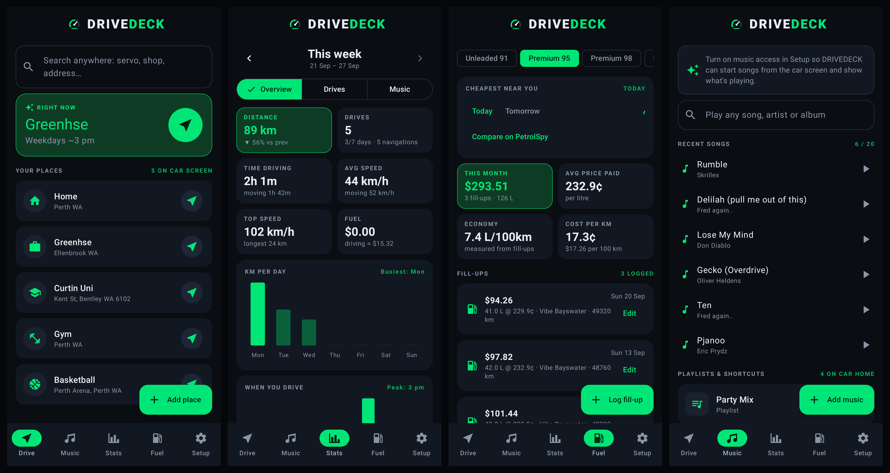
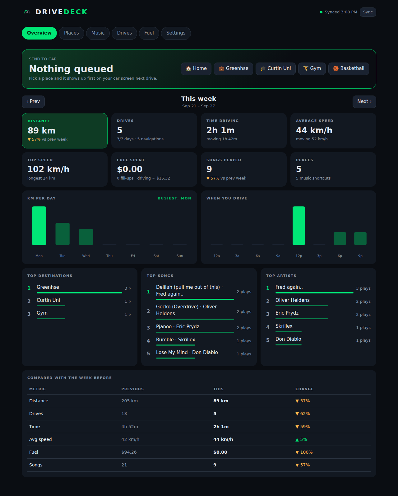
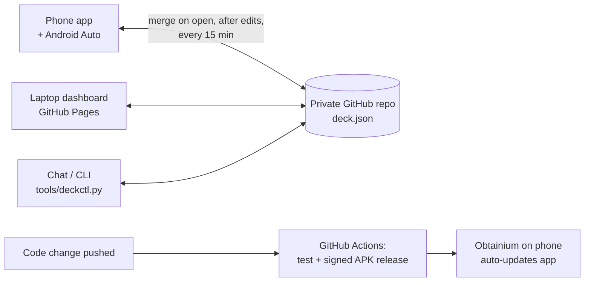

<div align="center">

# DRIVEDECK

**An Android Auto companion that gives your car what it's missing: one-tap destinations that learn your routine, a real trip computer, live fuel prices, speed camera alerts, WhatsApp on the car screen, YouTube Music at a tap, and weekly driving stats. Everything syncs between your phone, a laptop dashboard and chat.**

Kotlin · Jetpack Compose · Android for Cars App Library · GitHub-backed sync · 57 automated tests



</div>

---

## What it does

### In the car (Android Auto)
| Screen | What you get |
|---|---|
| **Where to?** | Your places as big tiles. The first tile is what you usually do *right now* (learned from your trips), or a place you sent from your laptop. One tap and Waze or Google Maps starts driving. |
| **Search** | Search any place or address, with results nearest first, or hand the words straight to Waze or Maps. |
| **Trip computer** | Live speed, **average speed** (overall and while moving), **max speed**, distance, moving vs stopped time. Records every drive automatically. |
| **Smart ETA** | Three arrival times side by side: **with traffic** (read live from Waze or Maps), **your ETA** (from how long *you* usually take at this time of day), and **no traffic**. |
| **Speed cameras** | Voice alert "Speed camera ahead, 60 zone" for fixed and red-light cameras on your road, plus a map of the cameras near you. |
| **Fuel** | Cheapest fuel near you **today and tomorrow** from FuelWatch (WA), on a map. Tap to drive there. |
| **WhatsApp** | Who messaged and how many new messages, **read aloud**, one-tap quick replies. Full text shows when you're parked. |
| **Music** | Your YouTube Music playlists, song search, and your **last 20 songs** as one-tap tiles. |
| **This week** | Km, drives, time behind the wheel, average and top speed, fuel spend, songs played. |

### On the phone
**Drive** (search, places, live trip) · **Music** (search, recents, playlists) · **Stats** (weekly review with charts, drive history, music stats) · **Fuel** (live prices, fill-up log, L/100km, cost per km) · **Setup** (sync, permissions, car settings).

### On the laptop
The [**dashboard**](https://lazarzec18.github.io/DRIVEDECK/): weekly overview and charts, **Send to car**, edit places and music, drive history, fuel log and settings. Changes reach the phone within seconds.



## How sync works



- **Data:** one `deck.json` in a *private* repo. Every change is a commit, so there's full history and any change can be undone.
- **Conflicts:** the phone, the dashboard and the CLI use the same merge rules (`DeckMerge`). Each item keeps its newest edit, deletes are tombstones, and trips, drives and plays are unions. Edit on your laptop while driving and nothing is lost.
- **App updates:** every push to `main` runs the tests and publishes a signed APK as a GitHub Release. Obtainium installs it over the top, keeping your data.

## Architecture

| Package | Responsibility |
|---|---|
| `car/` | Android Auto screens built with Car App Library templates (Grid, Pane, List, Search, PlaceListMap, LongMessage) |
| `smart/RoutinePredictor` | Learns your usual destination: time-of-day Gaussian, weekday pool, 45-day recency decay |
| `trip/` | Trip computer foreground service and GPS maths (`TripAccumulator`: jitter, glitch and tunnel filtering) |
| `eta/` | Road route (OSRM), personal ETA from your history, live ETA read from the Waze or Maps navigation notification |
| `cameras/` | Speed and red-light cameras from OpenStreetMap, plus "ahead of you" detection (bearing ± 30°) |
| `fuel/` | FuelWatch RSS client, today and tomorrow |
| `music/` | YouTube Music control through its media session, recent songs, song-play logging |
| `messages/` | WhatsApp chats from notifications, replies through WhatsApp's own reply action, text-to-speech |
| `stats/` | Weekly review engine (the same maths as the dashboard) |
| `sync/` | GitHub contents API client, pull → merge → push loop, WorkManager background sync |
| `docs/index.html` | Laptop dashboard, one static file on GitHub Pages |
| `tools/deckctl.py` | CLI for chat or terminal control: add places, send to car, log fuel, stats |

## Install

1. **Phone:** install the APK from [Releases](../../releases). Play Protect may block it because of the notification permission: in the Play Store, go to Profile → Play Protect → ⚙ → turn off *Scan apps*, install, then turn it back on.
2. **Setup tab:** enable *Music & messages access* (Samsung: App info → ⋮ → *Allow restricted settings* first), allow location and notifications, and paste your sync token.
3. **Android Auto:** Settings → Connected devices → Android Auto → tap *Version* 10× → ⋮ → Developer settings → tick **Unknown sources** → Customise launcher → tick DRIVEDECK.
4. **Auto-updates:** install [Obtainium](https://github.com/ImranR98/Obtainium), then *Add app* → `https://github.com/LAZARZEC18/DRIVEDECK`.

## Build & test

```bash
./gradlew testDebugUnitTest      # 57 tests: predictor, merge, trip maths, stats, ETA, cameras, FuelWatch, car templates, UI renders
./gradlew lintDebug              # clean
./gradlew assembleDebug
./gradlew testDebugUnitTest -Proborazzi.record   # re-render docs/screenshots
```

## Privacy

No accounts and no servers of our own. Data lives on your phone and in *your* private GitHub repo. WhatsApp message text is only held in memory while unread, and is never saved or synced.

## Limits

- Android Auto hands navigation to the nav app you last opened on the car screen. On the phone you pick Waze or Google Maps per trip.
- Showing message text while the car is moving isn't allowed by Android Auto. You get sender, count, read-aloud and quick replies instead.
- YouTube Music has no public API. Playback uses Android's media session (the same way Google Assistant does it).
- Camera alerts cover fixed and red-light cameras. Mobile camera vans move daily, and Waze and Maps warn about those from driver reports.

Icons: [Material Design Icons](https://pictogrammers.com/library/mdi/) (Apache 2.0). Map data © OpenStreetMap contributors. Fuel prices © FuelWatch WA.
Built by **Lazar**, Perth WA.
